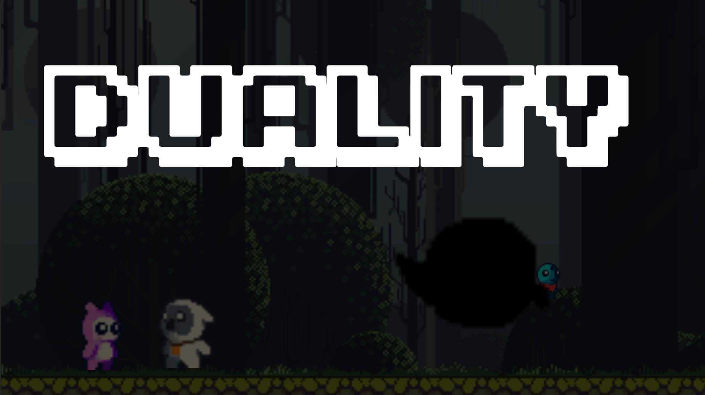
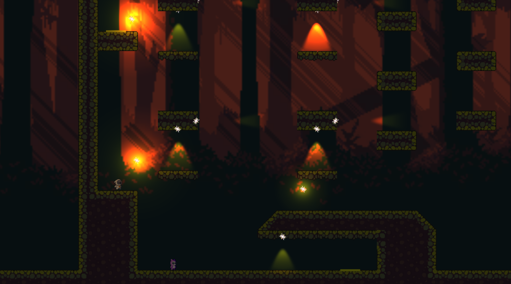
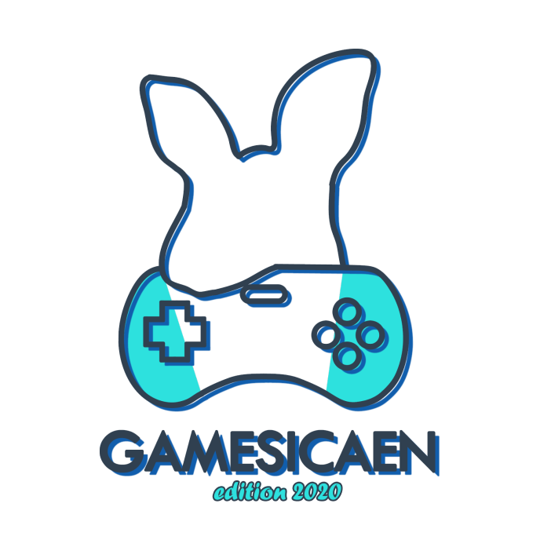

# Duality
Lily and Whitou venture into a dark forest in order to look for Blau, their playing partner, who was kidnaped by Bouh, the haunting spirit.   Responding to the forest’s magic, the two protagonists seem to be afflicted by the auras of Light and Darkness around them. Facing the complexity of the forest, they must continue their journey and rescue their friend.

This game was made during the GameSicaen 2020. 

It's a gamejam organized by students at ENSICAEN, a french engineering school.

A gamejam is a hackathon design for game development: in teams of 4, you have 48h 
for creating a working game

GameSicaen 2020 logo made by Loreena Liotard

[Check the game](https://ywikyx.itch.io/duality) on itch.io
